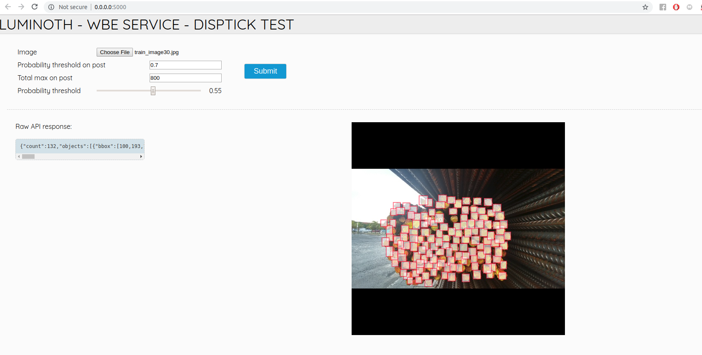
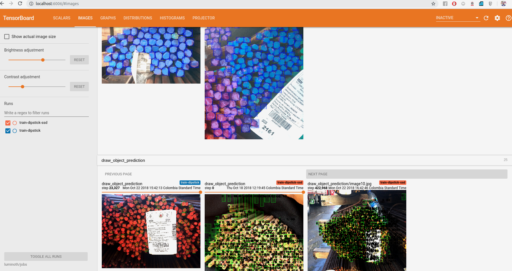
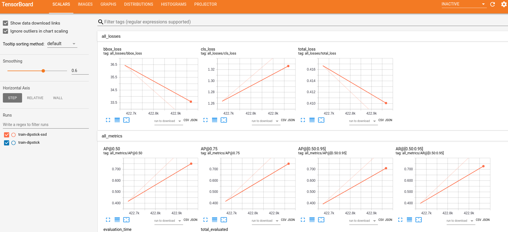

# Object detection of dipsticks or rods

POWERED BY
▀█▀ ▒█▄░▒█ ▒█░▄▀ ▒█▀▀█ ▒█▀▀▀ ▒█▀▄▀█ ▒█▀▀▀ ▒█▄░▒█ ▀▀█▀▀ ░█▀▀█ ▒█░░░
▒█░ ▒█▒█▒█ ▒█▀▄░ ▒█▄▄▀ ▒█▀▀▀ ▒█▒█▒█ ▒█▀▀▀ ▒█▒█▒█ ░▒█░░ ▒█▄▄█ ▒█░░░
▄█▄ ▒█░░▀█ ▒█░▒█ ▒█░▒█ ▒█▄▄▄ ▒█░░▒█ ▒█▄▄▄ ▒█░░▀█ ░▒█░░ ▒█░▒█ ▒█▄▄█
https://www.inkremental.co/

Web service with algorithms for detecting objects in trained images with the trained and predicted with the Luminoth framwork and exposed with Flask

The images consists of metal bars positioned on banners, the rods are horizontally reclined, they would be photographed (optional: with additional parameters {height and width rods in pixels} but it's not used)


## Usage API

Make post to api:

```bash
curl -X POST \
  http://0.0.0.0:5000/api/fasterrcnn/predict/ \
  -H 'content-type: multipart/form-data\
  -F image=@/home/inkremental-3/gitKraken/dipstick/VOC_dipstick_512/JPEGImages/valid_task_image39.jpg \ # Required
  -F min_prob=0.7 \ # Optional FLOAT, get obj.prob >= min_prob
  -F total=800 \ # Optional NUMBER, get max ${total} objects 
  -F only_number=True \ # Optional,True or False get only len(objects)
```

### Response

Normal response:

```json
{
    "count": 130,
    "objects": [
        {
            "bbox": [
                453,
                164,
                491,
                206
            ],
            "label": "dipstick",
            "prob": 1
        }, ...
    ]
}
```

With only_number=True

```json
{
    "count": 130
}
```

Possible errors

```json
{
    "count": -1,
    "error": "Use POST method to send image."
}
{
    "count": -2,
    "error": "Missing image"
}
{
    "count": -3,
    "error": "Incompatible file type"
}
{
    "count": -666,
    "data": "Stack trace......",
    "error": "Unkown,error"
}
```

## Usage App web

Go to [http://0.0.0.0:5000/](http://0.0.0.0:5000/)



## Installation

Luminoth currently supports Python 2.7 and 3.4–3.6.

### Pre-requisites

To use Luminoth, [TensorFlow](https://www.tensorflow.org/install/) must be installed beforehand. If you want **GPU support**, you should install the GPU version of TensorFlow with `pip install tensorflow-gpu`, or else you can use the CPU version using `pip install tensorflow`.

### Installing from source

First, clone the repo on your machine and then install with `pip`:

```bash
!git clone https://github.com/jsdussanc/luminoth.git
cd luminoth
pip install -e .
pip install -r luminoth/requeriments.txt
```

## Run web service

```bash
python luminoth/serve/web.py  --checkpoint <lumi-checkpoint> -c luminoth/examples/config_fasterrcnn_colab.yml
```

### Note

The checkpoints are saved in ~/.luminoth

## Training

See [Training your own model with google Colab](https://colab.research.google.com/drive/1jTOAqXUtvTUX-qImQUp-4gLIT7DYFrLy) to learn how to train locally or in Google Colab.

## Visualizing results

We strive to get useful and understandable summary and graph visualizations. We consider them to be essential not only for monitoring (duh!), but for getting a broader understanding of what's going under the hood. The same way it is important for code to be understandable and easy to follow, the computation graph should be as well.

By default summary and graph logs are saved to `jobs/` under the current directory. You can use TensorBoard by running:

see more [https://www.tensorflow.org/guide/summaries_and_tensorboard](https://www.tensorflow.org/guide/summaries_and_tensorboard)

```bash
tensorboard --logdir path/to/jobs
```



